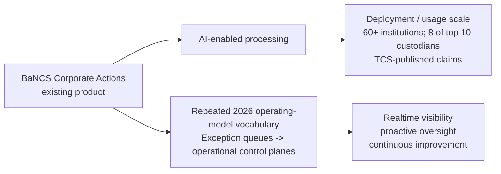

# TCS BaNCS Corporate Actions — From Exception Queues to Operational Control Planes

[[index|← Home]] · [[bfsi/capital-markets-ai]] · [[bfsi/risk-compliance-ai]] · [[events/public-event-watch]] · [[intelligence/public-operating-model-inference]]

> Public-evidence study only. This note does not describe internal TCS architecture and does not infer unnamed customer identities.

## Executive signal

Across two separate 2026 capital-markets events, TCS BaNCS repeated the same public phrase: **“Moving from Exception Queues to Operational Control Planes in Corporate Actions.”** The repetition matters because the wording appears in both the ISITC Annual Securities Operations Summit and SIFMA Ops 2026, while the same public pages describe the Corporate Actions solution as AI-enabled and already used/deployed at meaningful scale.

This is stronger than a single event slogan: it is a recurring product/operating-model vocabulary signal tied to an existing BaNCS solution and explicit deployment claims.

---

## Evidence point 1 — ISITC Annual Securities Operations Summit 2026

**Event date:** March 30, 2026  
**Publisher:** Tata Consultancy Services  
**Evidence class:** `deployed / product-capability / public-event`  
**Primary source:** https://www.tcs.com/who-we-are/events/tcs-bancs-isitc-annual-securities-operations-summit-2026

TCS BaNCS announced an Innovation Forum titled **“Moving from Exception Queues to Operational Control Planes in Corporate Actions.”** The public description says organisations are moving beyond exception-centric processing toward **real-time visibility, proactive oversight, and continuous improvement** across the corporate-actions lifecycle.

The same TCS event page states that the **AI-enabled Corporate Actions solution is deployed at more than 60 leading financial institutions** and supports automated end-to-end processing across multiple event and product types, including traditional, digital and tokenized assets.

### Evidence boundary

- The page establishes a deployment-scale claim for the BaNCS Corporate Actions solution.
- It does **not** identify all 60+ institutions.
- It does **not** state that every deployment uses the exact “operational control plane” design pattern.
- The event wording is public product/operating-model positioning, not an internal architecture specification.

---

## Evidence point 2 — SIFMA Ops 2026

**Event date:** May 11–14, 2026  
**Workshop date:** May 13, 2026  
**Publisher:** Tata Consultancy Services  
**Evidence class:** `deployed / product-capability / public-event`  
**Primary source:** https://www.tcs.com/who-we-are/events/tcs-bancs-sifma-ops-2026

TCS BaNCS repeated the same workshop title: **“Moving from exception queues to operational control planes in corporate actions.”** The page again connects the concept to real-time visibility, proactive oversight and continuous improvement.

The event page describes the Corporate Actions solution as **AI-enabled** and says it provides automated end-to-end processing across multiple event and product types, including traditional, digital and tokenized asset forms.

The same page states that the solution is **used by eight of the world’s top ten custodians**.

### Evidence boundary

- This is a TCS-published scale claim and should remain attributed to TCS.
- The page does not name the eight custodians.
- Anonymous institutions must not be reverse-engineered from market-share clues.
- The page does not prove that every user has adopted the control-plane operating model.

---

## Cross-source debugging

### Status transition

The combined public evidence is stronger than pure thought leadership:

**Diagram status:** editorial reconstruction from public TCS event wording; not an internal TCS architecture diagram.

### Vocabulary transition

Older post-trade automation language often emphasizes:
- straight-through processing
- exception management
- workflow automation

The 2026 TCS BaNCS event language adds a stronger supervisory abstraction:
- **operational control plane**
- real-time visibility
- proactive oversight
- continuous improvement

This suggests a public shift in emphasis from handling exceptions after they surface toward a continuously monitored operating layer around the corporate-actions lifecycle.

### Relationship to broader TCS control-plane vocabulary

TCS separately uses “control plane” in enterprise-AI public material to describe orchestration, governance, monitoring, evaluation, auditability and policy enforcement across AI systems. That broader usage should **not** be assumed to mean the BaNCS Corporate Actions solution implements the same technical stack.

The safe higher-order observation is only that **control-plane vocabulary is recurring across multiple TCS public domains**, including enterprise AI and securities operations, with each source retaining its own scope.

---

## Intelligence assessment

**Materiality:** high  
**Confidence:** high for the public claims; medium for any architectural interpretation beyond them

### What changed in the public picture

1. BaNCS Corporate Actions has explicit 2026 **deployment/usage-scale evidence**, not just feature marketing.
2. TCS repeated the exact **operational control-plane** framing across two separate capital-markets events.
3. The public operating-model language links AI-enabled automation with **continuous visibility and oversight**, not only exception processing.

### Inference decision

No new entry is promoted into [[intelligence/public-operating-model-inference]] yet.

Reason: the two capital-markets event pages are independent event surfaces but from the same TCS product/source family. The pattern is significant and should be watched against future BaNCS product documentation, customer case studies, analyst material, or customer corroboration before being elevated to a new higher-order inference.

## Watch next

- named customer evidence for the AI-enabled Corporate Actions solution
- public architecture figures showing what TCS means by the corporate-actions “control plane”
- evidence that the terminology moves from event workshops into durable BaNCS product documentation
- customer or analyst corroboration of real-time supervisory/continuous-improvement outcomes
- evidence connecting, or explicitly separating, this securities-operations control plane from TCS enterprise-AI control-plane architecture
