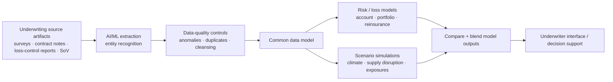

# TCS Underwriting Transformation Solution — Public AI/ML Architecture

[[index|← Home]] · [[bfsi/insurance-ai]] · [[bfsi/risk-compliance-ai]] · [[ai/agentic-ai-bfsi-architecture]]

## Evidence status

**Classification:** `product-capability`  
**Publisher:** Tata Consultancy Services  
**Source:** https://www.tcs.com/what-we-do/industries/insurance/solution/tcs-underwriting-transformation-solution  
**Publication date:** not reliably exposed on the retrieved public page; no date inferred  
**Confidence:** high for the product capabilities described by TCS; no deployment status inferred

## Public capability surface

TCS describes its Underwriting Transformation Solution as an AI/ML-powered offering for end-to-end underwriting transformation. The public page exposes three concrete capability groups.

### 1. Information gathering and data-quality preparation

TCS says the solution can automate extraction from underwriting artifacts including:

- surveys
- contract notes
- loss-control reports
- statements of values (SoV)

The same capability layer includes detecting data-quality issues such as anomalies and duplicates, as well as entity recognition.

This places data extraction, quality control and normalization explicitly upstream of risk analysis rather than treating underwriting AI as a model-only problem.

### 2. Portfolio and loss-risk analysis

TCS describes financial simulations for estimating losses, with automated side-by-side comparison of multiple outputs and a blended view of loss estimates.

The public page also lists analysis at account, portfolio and reinsurance levels and describes multiple loss-analysis views, including:

- average annual loss
- aggregate loss
- occurrence loss
- excess loss

### 3. Scenario and disruption modelling

TCS also describes:

- non-catastrophic exposure modelling
- climate-risk analysis
- supply-side disruption analysis
- simulation of resulting financial losses

This makes the solution materially broader than document extraction: it combines AI/ML-assisted data preparation with analytical and simulation workflows used by underwriters.

## Public architecture signals

The page explicitly says the solution includes a **reference architecture**, a **common data model**, and simplified interfaces for underwriters. It also says the common data model supports aggregated inputs and outputs so multiple models can be run, compared and blended.

A useful public abstraction is therefore:

**Diagram status:** editorial reconstruction from the capabilities explicitly described on the public TCS page. It is **not** an internal TCS architecture diagram and does not reproduce TCS artwork.

## Cross-source intelligence relevance

This strengthens the repository's evidence for a recurring insurance-AI pattern that predates the current agentic-AI wave:

**heterogeneous insurance data → AI/ML extraction and data quality → common semantic/data layer → multiple analytical models → comparison/blending → human underwriting decision support.**

That pattern is structurally compatible with newer public TCS vocabulary around composite AI, context/knowledge layers and orchestration, but this page does **not** establish that the Underwriting Transformation Solution uses TCS Cognitive Automation Platform, AI WisdomNext, AI Spectrum for BFSI, Context Fabric, BaNCS AI Compass, GenAI or agentic AI. No such linkage is inferred.

## Evidence boundary

This source supports `product-capability` only.

It does **not** identify a customer, production deployment, implementation count, model family, foundation model, agent framework, latency, accuracy, cost, business KPI or regulator endorsement. The benefits on the page describe what the solution is intended to enable; they are not treated as measured customer outcomes unless a separate public implementation source establishes them.

## Why this matters

The page gives unusually concrete evidence of the **data-and-model engineering substrate** behind TCS insurance AI: extraction, quality controls, shared data representation, model execution, scenario simulation and model-output blending. That helps prevent the public intelligence graph from over-indexing on newer GenAI/agentic messaging and preserves continuity with TCS' earlier quantitative and ML-driven insurance capability stack.

## Related

[[bfsi/insurance-ai]] · [[bfsi/risk-compliance-ai]] · [[research/advanced-quantz-analytics-public-capability]] · [[tcs/public-language-glossary]]
