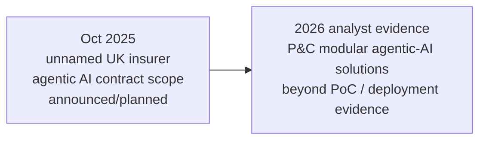

# UK insurance services provider — agentic AI across front and back office

[[index|← Home]] · [[bfsi/insurance-ai]] · [[bfsi/public-implementations]] · [[intelligence/public-operating-model-inference]]

## Evidence record

- **Source date:** 2025-10-09
- **Publisher:** Tata Consultancy Services — Q2 FY2026 financial-results press release
- **Evidence class:** `announced / planned`
- **Entity:** unnamed leading UK-based insurance services provider
- **Primary source:** https://www.tcs.com/who-we-are/newsroom/press-release/tcs-financial-results-q2-fy-2026
- **Confidence:** high for the existence/scope of the announced engagement; unknown for later production status

## What TCS publicly disclosed

TCS stated that it had secured a **multi-year strategic partnership with a leading UK-based insurance services provider** to transform and manage the insurer's digital platforms.

The announced scope had two distinct AI layers:

1. **AI-based engineering / IT operations:** TCS said it would deploy AI-based solutions to build an integrated engineering platform intended to optimize IT Change and Operations.
2. **Agentic AI in business operations:** TCS said **Agentic AI-enabled solutions would be delivered across front- and back-office functions** to improve operational efficiency and customer experience.

This is unusually useful public evidence because it places agentic AI directly inside an insurance transformation contract rather than presenting it only as a product capability, white-paper target state, or event demonstration.

## Evidence boundary

This source does **not** establish that the agentic-AI solutions were already production-live on 2025-10-09. The wording is forward-looking (`will deploy`, `will be delivered`), so the correct status is **`announced / planned`**, not `deployed`.

The customer is unnamed in the TCS source and remains unnamed here. No attempt should be made to infer its identity from geography, contract clues, other customers, or later analyst material.

The source also does not disclose:

- specific front- or back-office use cases
- agent architecture or model stack
- whether CAP, AI WisdomNext, AI Spectrum for BFSI, BaNCS, Context Fabric, or another TCS platform is used
- implementation milestones or go-live dates
- production volumes
- measured business outcomes
- human-oversight or governance mechanisms specific to this engagement

## Cross-source debugging significance

This item creates a useful chronological anchor before later 2026 public evidence that TCS insurance agentic-AI activity had moved beyond PoCs into modular deployments for complex claims workflows.

The defensible public sequence is therefore:

**Important:** these sources must not be joined as if they describe the same customer or project. They only support a broader time-ordered market signal that TCS was contracting for agentic-AI-enabled insurance operations by late 2025 and publicly describing beyond-PoC insurance deployments in 2026.

## Derived interpretation — not an internal fact

The combination strengthens an existing repository pattern: TCS' public insurance AI story is progressing from **AI-enabled platform/operations modernization → explicitly contracted agentic-AI front/back-office scope → modular deployment evidence in insurance workflows**.

This note alone does not justify a new higher-order operating-model inference because the customer remains unnamed and there is no independent corroboration linking this exact contract to a later deployed case.

## Related

[[bfsi/insurance-ai]] · [[bfsi/public-implementations]] · [[research/pc-insurance-agentic-ai-beyond-poc]] · [[intelligence/public-operating-model-inference]]
