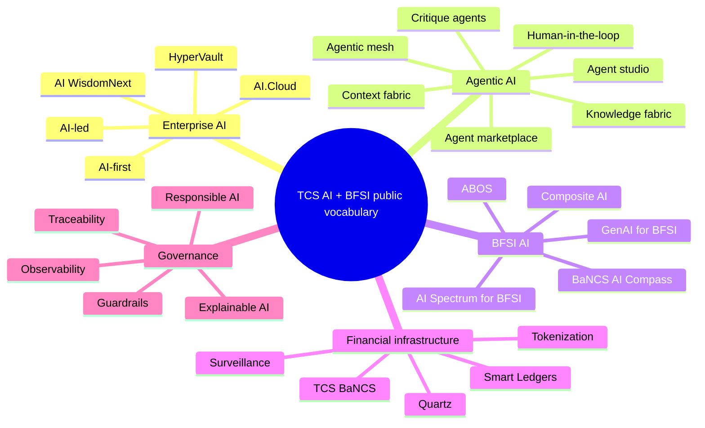
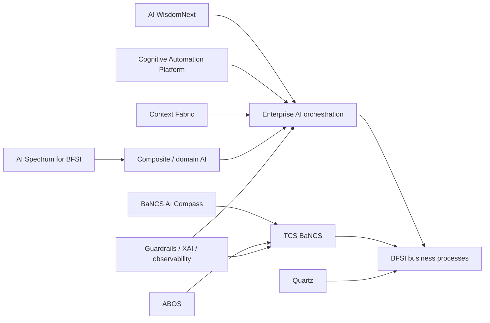

# TCS AI + BFSI — Public Language & Product Glossary

[[index|← Home]] · [[atlas/architecture-atlas]] · [[tcs/tcs-bfsi-ai-offerings]] · [[bfsi/use-case-atlas]] · [[people/public-voices]]

> A source-backed dictionary of terms that recur across TCS public AI and BFSI material. Definitions are intentionally tied to public TCS wording instead of generic industry definitions.

## Fast map

---

## Company / enterprise AI terms

### AI-first

**Public usage:** TCS uses “AI-first” to describe enterprise transformation in which AI is treated as a foundational operating capability rather than a narrow point solution.

**Sources:**
- [TCS AI services](https://www.tcs.com/what-we-do/services/artificial-intelligence)
- [TCS GenAI for BFSI](https://www.tcs.com/what-we-do/industries/banking/genai-insurance-banking-financial-services)

---

### AI-led

**Public usage:** recurring TCS corporate language for transformation/growth driven by AI capabilities across services and operations.

**Evidence note:** “AI-led” is strategy language; it is not by itself evidence that a specific process is AI-controlled in production.

Source context: [[tcs/tcs-ai-strategy]]

---

### TCS AI WisdomNext™

**Public meaning:** an enterprise AI orchestration layer that integrates models, agents and data, with workflow design, governance, observability and cost visibility.

**Named public capabilities:** task/agent orchestration, flow design, agent/tool discovery, model evaluation, centralized guardrails, enterprise data pipelines, deployment across SaaS/containerized cloud/on-premises environments.

Sources:
- [WisdomNext solution page](https://www.tcs.com/what-we-do/services/artificial-intelligence/solution/enterprise-generative-ai-adoption-wisdomnext)
- [Launch announcement](https://www.tcs.com/who-we-are/newsroom/press-release/tcs-launches-wisdomnext-an-industry-first-genai-aggregation-platform)
- [Official TCSGlobal video](https://www.youtube.com/watch?v=FhQSMJT0vwc)

---

### HyperVault

**Public meaning:** TCS-branded AI infrastructure initiative captured in [[tcs/tcs-ai-strategy]]. Use the primary source linked there for exact investment/status details.

**Evidence discipline:** infrastructure initiative, not a BFSI product by default.

---

### AI.Cloud

**Public usage:** TCS organization/capability branding that appears in public AI/cloud material and executive titles.

**Do not infer:** internal reporting lines beyond what TCS itself publishes.

---

## Agentic AI vocabulary

### Agentic AI

**Public TCS framing:** AI systems/agents capable of planning, reasoning, adapting and executing multi-step tasks or workflows, with increasing autonomy compared with conventional automation or standalone GenAI.

BFSI examples publicly discussed by TCS include credit-risk assessment, AML/compliance monitoring, advisory, customer engagement, fraud investigation and operations.

Sources:
- [Context Fabric – Agentic AI in BFSI](https://www.tcs.com/what-we-do/industries/banking/white-paper/context-fabric-backbone-agentic-ai-bfsi)
- [TCS Cognitive Automation Platform](https://www.tcs.com/what-we-do/industries/insurance/solution/cognitive-automation-platform-transform-banking)

---

### Agentic mesh

**Public meaning in CAP:** a mechanism for orchestrating multiple autonomous AI agents across business and IT workflows.

Source: [TCS Cognitive Automation Platform](https://www.tcs.com/what-we-do/industries/insurance/solution/cognitive-automation-platform-transform-banking)

---

### Agent marketplace

**Public meaning in CAP:** a library/marketplace of reusable agents. TCS publicly states **200+ pre-built, reusable, domain-trained AI agents** on the CAP page.

Source: [CAP](https://www.tcs.com/what-we-do/industries/insurance/solution/cognitive-automation-platform-transform-banking)

---

### Agent studio / agent builder

**Public meaning in CAP:** tooling for designing, configuring, testing and deploying agents, with guardrails/policy controls and modular pre/post-processing.

Source: [CAP](https://www.tcs.com/what-we-do/industries/insurance/solution/cognitive-automation-platform-transform-banking)

---

### Critique agent / compliance agent

**Public meaning in Context Fabric architecture:** an agent that validates rationale, evidence and policy conformance before actions are taken.

Source: [Context Fabric white paper](https://www.tcs.com/what-we-do/industries/banking/white-paper/context-fabric-backbone-agentic-ai-bfsi)

---

### Context fabric

**Public TCS meaning:** a semantic, adaptive enterprise layer unifying process, regulatory, domain and data context so agents can make context-aware, explainable and policy-aligned decisions.

TCS describes three operational pillars:
- **Externalisation** — create accessible business/data context outside individual applications.
- **Harness** — inject context into agent runtime.
- **Manage** — keep context current through controlled learning and enterprise knowledge.

Source: [Context Fabric – The Backbone of Agentic AI in BFSI](https://www.tcs.com/what-we-do/industries/banking/white-paper/context-fabric-backbone-agentic-ai-bfsi)

---

### Knowledge fabric

**Public usage in CAP:** enterprise/external knowledge plus contextual business knowledge used to power agent reasoning, including adaptive ingestion and RAG.

**Distinction:** “knowledge fabric” on CAP and “context fabric” in the BFSI white paper are related public concepts but should not automatically be assumed to be the same implementation.

---

### Super cognitive knowledge management

**Public usage in CAP:** a knowledge-management layer described as accelerating discovery, analysis and decision-making.

Source: [CAP](https://www.tcs.com/what-we-do/industries/insurance/solution/cognitive-automation-platform-transform-banking)

---

### Transform.ai

**Public usage in CAP:** an AI-agent-assisted transformation-assessment capability included in the Cognitive Automation Platform public description.

Source: [CAP](https://www.tcs.com/what-we-do/industries/insurance/solution/cognitive-automation-platform-transform-banking)

---

### Machine-first, human-in-the-loop

**Public TCS BFSI framing:** machines/AI perform suitable work while human verification/oversight remains part of higher-risk or controlled decision processes.

Source: [TCS GenAI for BFSI](https://www.tcs.com/what-we-do/industries/banking/genai-insurance-banking-financial-services)

---

## BFSI AI products / concepts

### TCS AI Spectrum for BFSI

**Public meaning:** an end-to-end framework for operationalizing **Composite AI** across BFSI using NVIDIA technologies.

Publicly named NVIDIA components include NeMo Curator, embedding models, NeMo Customizer, NeMo Guardrails, NIM and TensorRT.

Source: [TCS AI Spectrum for BFSI](https://www.tcs.com/what-we-do/industries/banking/solution/tcs-ai-spectrum-for-bfsi)

---

### Composite AI

**Public meaning on AI Spectrum:** combined use of **predictive AI and generative AI** rather than relying on one AI technique.

Source: [AI Spectrum for BFSI](https://www.tcs.com/what-we-do/industries/banking/solution/tcs-ai-spectrum-for-bfsi)

---

### TCS GenAI for BFSI

**Public capability framing:** TCS describes an **assist → augment → transform** progression supported by a data/integration-intensive polyglot architecture, machine-first/human-in-the-loop working, and enterprise guardrails/ethics.

Source: [TCS GenAI for BFSI](https://www.tcs.com/what-we-do/industries/banking/genai-insurance-banking-financial-services)

---

### TCS BaNCS AI Compass

**Status:** `announced` — December 19, 2025.

**Public meaning:** an AI core design for TCS BaNCS combining machine learning/deep learning, GenAI and pre-built intelligent agents for banking and securities-services customers, with responsible/explainable/traceable AI positioning.

Source: [TCS BaNCS AI Compass announcement](https://www.tcs.com/who-we-are/newsroom/press-release/tcs-bancs-ai-upgrade-new-core-tool-supercharge-innovation)

---

### ABOS

**Public TCS BaNCS description:** a **fully agentic AI-driven bank operating platform** concept described in BaNCS Research Journal Issue 16.

Named public layers:
1. Genesis layer
2. Hyper-composability layer
3. Autonomous product layer
4. Autonomous watchdog layer
5. Adaptive AI engine

**Evidence status:** `thought-leadership/product-concept` unless separate deployment evidence is published.

Sources:
- [ABOS article](https://www.tcs.com/what-we-do/products-platforms/tcs-bancs/articles/redefining-banking-intelligence-abos)
- [BaNCS Research Journal 16](https://www.tcs.com/what-we-do/products-platforms/tcs-bancs/research-journal/tcs-bancs-research-journal-16-future-finance)

---

### Genesis layer

**ABOS public meaning:** natural-language-driven bank modelling; public text says business models can be described in plain language and interpreted into microservices/APIs/compliance rules.

---

### Hyper-composability layer

**ABOS public meaning:** agent-based workflow orchestration, dynamic service composition and real-time adaptation.

---

### Autonomous product layer

**ABOS public meaning:** AI-supported rapid product innovation using risk, market and customer information to propose/create banking products.

---

### Autonomous watchdog layer

**ABOS public meaning:** continuous compliance/oversight, fraud/AML monitoring and response to regulatory change.

---

### Adaptive AI engine

**ABOS public meaning:** a learning/adaptation component described as using behavior and predictive models to suggest improvements and manage risk.

---

## Financial-platform vocabulary

### TCS BaNCS™

TCS' flagship financial-services product suite spanning areas including banking, securities, market infrastructure and insurance. AI-specific developments are tracked in [[tcs/tcs-bfsi-ai-offerings]] and [[bfsi/banking-ai]].

Official product area: [TCS BaNCS](https://www.tcs.com/what-we-do/products-platforms/tcs-bancs)

---

### Quartz™ / The Smart Ledgers™

**Public meaning:** TCS platform/solution family combining DLT, AI/ML and conventional technology for ecosystem-level processes. Public design language emphasizes **co-existence**, integration and a mix of on-chain/off-chain services.

Source: [Quartz](https://www.tcs.com/what-we-do/products-platforms/quartz)

---

### Trusted intelligence

**Public Quartz terminology:** combining DLT's shared/tamper-evident characteristics with AI/ML and governance to support ecosystem processes.

---

### Quartz Gateway

**Public meaning:** integration layer used to connect enterprise systems with Quartz ecosystems.

Source: [Quartz](https://www.tcs.com/what-we-do/products-platforms/quartz)

---

### Quartz Command Center

**Public meaning:** administration/operations component for blockchain ecosystems in the Quartz portfolio.

---

### Quartz for Surveillance

**Public meaning:** trade-surveillance solution supporting multi-asset/multi-market monitoring and using AI/ML/NLP to identify suspicious behavior and potential market abuse.

Source: [Quartz for Surveillance](https://www.tcs.com/what-we-do/products-platforms/quartz/solution/quartz-surveillance)

---

### Quartz for Markets

**Public meaning:** services/solutions around traditional and tokenized securities for market-infrastructure institutions and financial entities.

Sources:
- [Quartz for Markets](https://www.tcs.com/what-we-do/products-platforms/quartz/solution/tcs-quartz-for-market-traditional-tokenized-asset-solutions)
- [2025 brochure PDF](https://www.tcs.com/content/dam/global-tcs/en/pdfs/what-we-do/platforms/tcs-quartz/solution/2025-quartz-markets.pdf)

---

## Governance / engineering vocabulary

### Guardrails

Public TCS materials use this term for configurable controls limiting unsafe, non-compliant or out-of-policy model/agent behavior. Examples include policy enforcement, PII detection, topical safety and hallucination controls.

---

### Explainable AI / traceable AI

Publicly emphasized in the BaNCS AI Compass announcement and responsible-AI material. In context, the terms refer to being able to understand/trace AI processes and outcomes rather than treating outputs as opaque.

---

### Observability

Publicly emphasized in CAP and WisdomNext as runtime/process visibility across agent/workflow execution. TCS pairs observability with governance and evaluation in its enterprise-AI positioning.

---

### Evaluation

TCS public materials describe continuous evaluation or evaluator bots in CAP/WisdomNext contexts. Evaluation is presented as part of production AI control rather than a one-time model benchmark.

---

### Polyglot architecture

Public GenAI-for-BFSI language indicating an architecture that integrates multiple data, technology and AI components rather than standardizing the entire stack on one model/vendor.

---

### AI-ready data

Public TCS BFSI material uses this to describe governed, high-quality, contextual enterprise data suitable for AI consumption. Related note: [[bfsi/risk-compliance-ai]].

Source: [Modern MDM: AI-ready Data to Scale Enterprise AI in BFSI](https://www.tcs.com/what-we-do/industries/banking/white-paper/modern-mdm-ai-ready-enterprise-data-bfsi)

---

## Relationship graph

## Related

- [[atlas/architecture-atlas]]
- [[bfsi/use-case-atlas]]
- [[media/watchlist]]
- [[media/visual-reference-library]]
- [[people/public-voices]]
