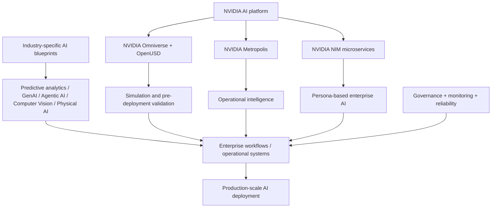

# TCS Rapid Outcome AI — Public Capability Study

[[index|← Home]] · [[tcs/tcs-ai-strategy]] · [[tcs/public-ai-initiative-index]] · [[tcs/ai-partnerships]] · [[atlas/architecture-atlas]]

> Evidence boundary: this note records public TCS product/announcement material. It does **not** establish a named banking production deployment unless a separate customer source is cited.

## Evidence status

- **2026-03-17 launch:** `announced / product-capability`
- **Current TCS solution page:** `product-capability`
- **BFSI relevance:** explicit because TCS lists **banking** among industries supported by the platform.
- **Named BFSI production customer evidence:** not established by the cited sources.

## Why this platform matters

TCS positions Rapid Outcome AI as an enterprise platform for moving AI from experimentation and proofs of concept into reliable, governed, production-scale deployment. The public material is especially useful because it makes the productionization layer explicit: blueprints, deployment consistency, simulation, monitoring, governance, reliability and enterprise integration.

Primary sources:

- Launch announcement, 17 Mar 2026: https://www.tcs.com/who-we-are/newsroom/press-release/tcs-launches-rapid-outcome-ai-platform-powered-nvidia
- Current solution page: https://www.tcs.com/what-we-do/services/artificial-intelligence/solution/tcs-rapid-outcome-ai

## Public capability stack

TCS publicly describes the platform as combining:

- predictive analytics
- generative AI
- computer vision
- agentic AI
- physical AI
- NVIDIA accelerated computing
- industry-specific AI blueprints
- simulation before real-world deployment
- operational intelligence
- persona-based enterprise AI assistants
- governance and monitoring

The platform is described as supporting manufacturing, telecommunications, **banking**, retail, life sciences and engineering services.

## Editorial study reconstruction

The diagram below is an editorial reconstruction of the architecture/capability relationships described in TCS public material. It is **not** an internal TCS architecture diagram.

## Public productionization problem statement

TCS' current solution page identifies recurring barriers to scaling AI:

1. fragmented AI deployments using different tools/models/frameworks
2. operational integration across enterprise applications and environments
3. inability to move successful pilots into large-scale deployments
4. limited monitoring and observability after deployment

The stated answer is a blueprint-led platform that lets enterprises design, deploy and scale AI applications consistently while maintaining governance, reliability and enterprise-grade performance.

## NVIDIA layer

The public material assigns distinct NVIDIA technologies to different capability layers:

| NVIDIA technology | Public role described by TCS |
|---|---|
| Accelerated computing | platform compute foundation / AI at scale |
| NIM microservices | AI model deployment; persona-based assistants; analytics and automation |
| Omniverse + OpenUSD | simulation / digital-twin-style modelling before real-world deployment |
| Metropolis | vision AI agents and operational intelligence |

This relationship is implemented through TCS' dedicated NVIDIA Business Unit and joint go-to-market work.

## BFSI interpretation boundary

The public sources establish that banking is a supported industry, but the detailed examples on the launch page lean heavily toward industrial/telecom operational environments. Therefore:

- **Safe fact:** banking is explicitly included as a supported sector.
- **Safe inference:** the same productionization/governance framework can be relevant to banking AI workloads.
- **Not established:** that the industrial simulation/vision patterns are themselves deployed in a named banking client.

## Cross-source relationship

Rapid Outcome AI complements other public TCS AI surfaces but should not be collapsed into them:

- [[tcs/tcs-bfsi-ai-offerings|BFSI-specific platforms]] such as Cognitive Automation Platform and AI Spectrum focus directly on financial-services use cases.
- **Rapid Outcome AI** is a broader productionization platform with banking included among sectors.
- **TCS AI WisdomNext** focuses on governed model/data/agent orchestration and GenAI adoption.
- **NVIDIA relationship** spans both Rapid Outcome AI and BFSI-specific AI Spectrum, showing different products using the same strategic ecosystem at different layers.

## Intelligence implication

This platform strengthens an existing public pattern: TCS repeatedly frames enterprise AI value as a transition from **experimentation → governed operational integration → production scale**, rather than model creation alone.

This observation should be treated as supporting evidence for the existing productionization/scaling abstraction. It is not by itself a new internal operating-model claim.

## Related

[[tcs/tcs-ai-strategy]] · [[tcs/public-ai-initiative-index]] · [[tcs/ai-partnerships]] · [[ai/agentic-ai-bfsi-architecture]]
